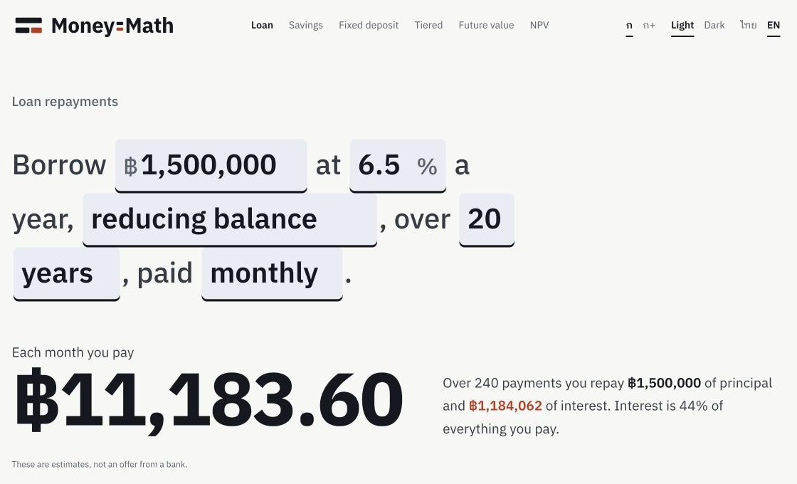

<h1>
  <picture>
    <source media="(prefers-color-scheme: dark)" srcset="public/logo-inverse.svg">
    
  </picture>
</h1>

**Live: [moneymath.thitichotk.com](https://moneymath.thitichotk.com)** (Thai and English, works offline once loaded)

Money-Math is a set of Thai loan, savings and deposit calculators. Each one asks its question as a sentence with
blanks to fill in, answers in one big number with a sentence explaining it, and prints the schedule like a bank
passbook. The rules are Thai banks' rules: interest by actual days over 365, savings interest paid on 30 June and
31 December, and the ฿20,000 savings-tax limit. Deposit rates can be filled in from what each bank reported to the
Bank of Thailand.



## What it does

| Calculator | What it answers |
|---|---|
| Loan | Each payment, total interest and every instalment, for reducing-balance or flat-rate (car hire-purchase) loans, with the flat rate's equivalent reducing-balance rate |
| Savings | Interest on a savings account with deposits and withdrawals along the way, accrued nightly and paid twice a year, with the ฿20,000 tax rule worked out per calendar year |
| Fixed deposit | Interest over one or more terms, rolled over or paid out, with 15% withholding tax, plus a table of what every bank would pay for the same term |
| Tiered | Interest on a tiered-rate account, where each slice of the balance earns its own rate |
| Future value | What a lump sum plus regular contributions grows to, by year |
| NPV | Net present value and internal rate of return for a series of cash flows |

Every result can be printed, exported as CSV (raw numbers, opens cleanly in Excel or Sheets), or shared: the inputs
live in the page's link, so the person you send it to sees the same numbers. Nothing you type is stored or sent
anywhere. The app only remembers your language, theme and text size.

## Run it locally

Needs Node 20.19+ and pnpm 10.

```bash
git clone https://github.com/thitichotk/money-math.git
cd money-math
pnpm install
cp .env.example .env   # optional: the Bank of Thailand rate pickers
pnpm dev               # http://localhost:5173
pnpm check             # lint, types and tests
pnpm build             # static site in dist/
```

Without `VITE_BOT_ENDPOINT` everything works except the "use a bank's rate" pickers, which show that rates are
unavailable.

Cloudflare Pages builds and deploys `main` on every push, and each pull request gets a preview link.

## How it works

- **Day count.** Deposits use Actual/365: the real number of nights between two dates, divided by 365, leap years
  included. Fixed-deposit terms are counted from the first start date, so one opened on 31 January matures at each
  month end instead of drifting.
- **Savings tax.** Interest is credited on 30 June, 31 December and the withdrawal date. If a calendar year's interest
  goes over ฿20,000, the bank withholds 15% of that whole year's interest, not just the part above the limit.
- **Loans.** Each instalment is rounded to the satang and the last one absorbs the remainder, so the rows add up to the
  total. Flat-rate loans charge interest on the original amount for the whole term, the way Thai car hire-purchase
  works.
- **Money maths** uses [decimal.js](https://github.com/MikeMcl/decimal.js), so ฿0.1 + ฿0.2 is ฿0.30.
- **Bank rates** come from the Bank of Thailand's
  [deposit-rate API](https://portal.api.bot.or.th/), through a small Cloudflare Worker at `rates.thitichotk.com` that
  holds the API key and caches responses. The tables show each bank's own figures for the latest business day; real
  offers can depend on the amount and the account's conditions.

These are estimates at a fixed rate, not an offer or advice from a bank.

| Path | Role |
|---|---|
| `src/domain/finance/` | The calculations (loan, savings, deposits, time value, Bangkok dates) and their Vitest tests |
| `src/pages/` | One page per calculator, plus home, about and not-found |
| `src/ui/` | The sentence blanks, answer, year chart, passbook, formula, bank-rate picker and layout |
| `src/services/bot/` | The Bank of Thailand rates client |
| `src/i18n/locales/` | Thai and English text |
| `src/styles/` | The Money-Math design system (`tokens.css`, `components.css`) and the page layout |

Built with React 19, Vite, react-router, i18next and zustand. The chart is hand-written SVG, and the formulas are
native MathML.

## Licence

[MIT](LICENSE) © 2025–2026 Thitichot K.

Not affiliated with the Bank of Thailand or any bank.
